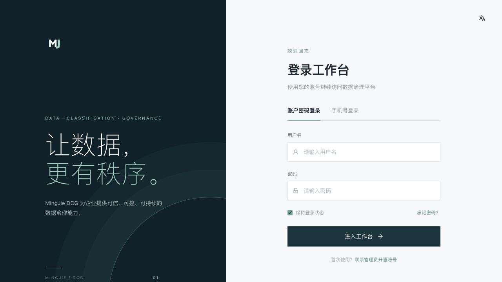
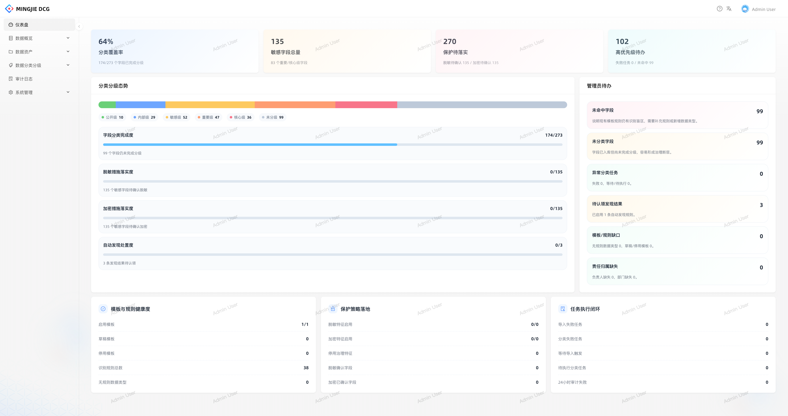
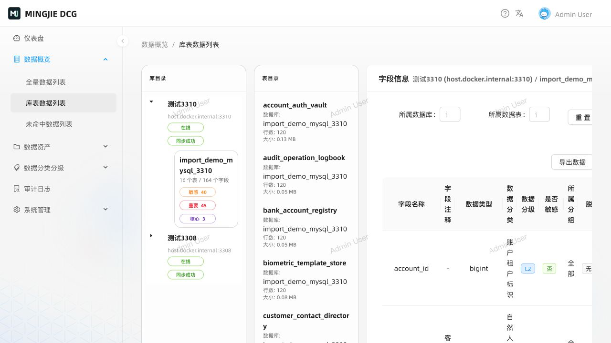
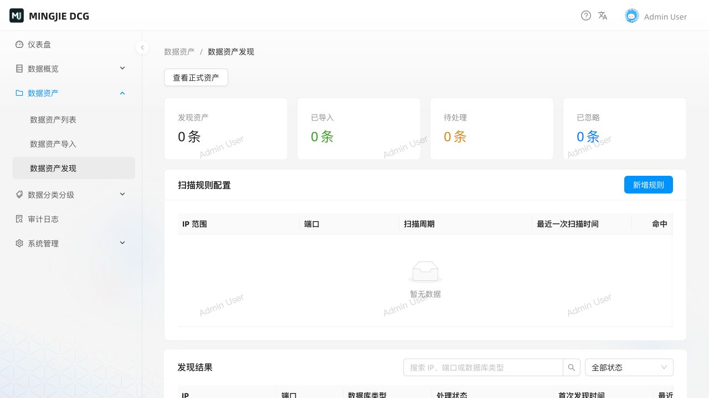
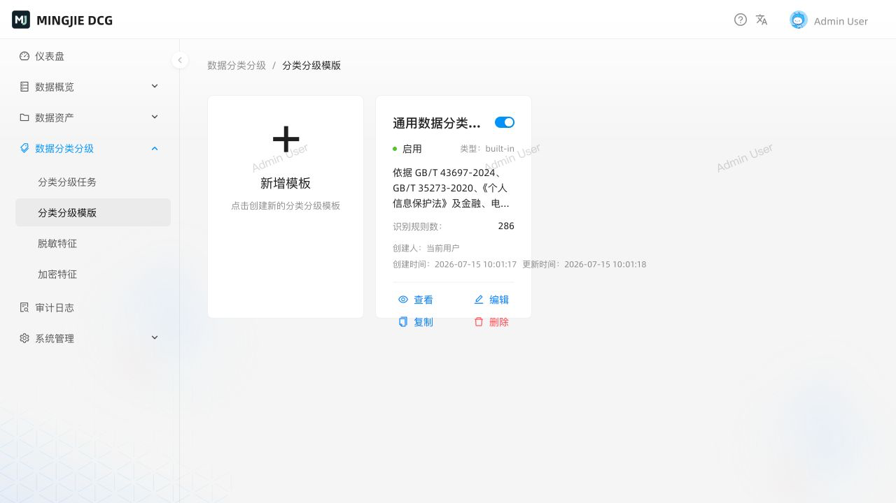

<p align="center">
  
</p>

<p align="center">
  <strong>MingJie 数据分类分级治理平台</strong>
</p>

<p align="center">
  数据资产发现 · 自动分类分级 · 敏感数据识别 · 脱敏加密策略 · 全链路审计
</p>

<p align="center">
  
  
  
  
  
  
  
</p>

---

## 平台简介

**MingJie** 是一款面向数据安全合规场景的数据分类分级治理平台。通过自动化的数据资产发现、智能分类分级引擎和灵活的保护策略，帮助快速建立数据安全治理体系。

### 核心能力

<table>
  <tr>
    <td width="50%">
      <h4>📊 数据总览</h4>
      <p>多维度数据资产统计仪表盘，支持全量数据、表级数据、遗漏数据等视图，一目了然掌握数据治理全局。</p>
    </td>
    <td width="50%">
      <h4>🗂 数据资产管理</h4>
      <p>树形资产分组体系，自动采集数据库/表/列元数据，构建完整的数据资产目录。</p>
    </td>
  </tr>
  <tr>
    <td>
      <h4>🔄 数据导入</h4>
      <p>多源数据库连接，批量导入任务编排，字段级采样策略，实时进度追踪与异常处理。</p>
    </td>
    <td>
      <h4>🔍 自动扫描</h4>
      <p>基于 Cron 表达式的定时扫描规则，自动发现新增数据资产，扫描结果可一键认领入库。</p>
    </td>
  </tr>
  <tr>
    <td>
      <h4>🏷 分类分级</h4>
      <p>模板化分类框架 + 正则规则引擎，支持公开/内部/机密/绝密四级数据分级，任务化批量执行。</p>
    </td>
    <td>
      <h4>🔐 脱敏加密</h4>
      <p>基于数据级别的脱敏与加密策略定义，关联分类结果自动匹配保护规则。</p>
    </td>
  </tr>
  <tr>
    <td>
      <h4>📝 审计日志</h4>
      <p>全操作审计追踪，覆盖认证、资产管理、分类任务、自动扫描等完整业务链路。</p>
    </td>
    <td>
      <h4>👥 用户与角色</h4>
      <p>RBAC 细粒度权限模型，8 个权限组 23 项权限，内置四种预设角色开箱即用。</p>
    </td>
  </tr>
</table>

---

## 部署效果截图

Docker 部署成功后访问 `http://localhost:8000`，可以看到以下产品界面：

### 登录页



### 仪表盘



### 库表数据列表



### 数据资产发现



### 分类分级模板



默认模板的标准依据、分级边界和规则维护方法见 [分类分级基线说明](docs/classification-grading-baseline.md)。
内置加密与脱敏识别范围、格式来源和识别边界见 [加密与脱敏特征基线](docs/protection-feature-catalog.md)。

---

## 架构设计

```
┌─────────────────────────────────────────────────────┐
│                    前端 (React 19)                    │
│         UMI Max · Ant Design 5 · Pro Components      │
└──────────────────────┬──────────────────────────────┘
                       │ HTTP / REST API
┌──────────────────────▼──────────────────────────────┐
│                  后端 (NestJS 11)                     │
│                                                      │
│  ┌──────────┐ ┌──────────┐ ┌──────────┐ ┌────────┐  │
│  │ 认证鉴权  │ │ 资产管理  │ │ 分类引擎  │ │ 自动扫描│  │
│  │ JWT+RBAC │ │ 导入/发现 │ │ 模板/规则 │ │ 定时任务│  │
│  └──────────┘ └──────────┘ └──────────┘ └────────┘  │
│  ┌──────────┐ ┌──────────┐ ┌──────────┐ ┌────────┐  │
│  │ 脱敏加密  │ │ 审计日志  │ │ 用户角色  │ │ 任务调度│  │
│  └──────────┘ └──────────┘ └──────────┘ └────────┘  │
│                                                      │
│              Prisma ORM · Swagger/OpenAPI             │
└──────────────────────┬──────────────────────────────┘
                       │
┌──────────────────────▼──────────────────────────────┐
│                   MySQL 8.4                          │
│              Docker Compose 容器编排                  │
└─────────────────────────────────────────────────────┘
```

---

## 快速开始

### 环境要求

| 依赖 | 版本要求 |
|------|---------|
| Docker & Docker Compose | latest |
| 系统内存 | >= 3.6 GB |

### Docker 启动

```bash
git clone https://github.com/Junp0/MingJie.git
cd MingJie
docker compose -f docker-compose.prod.yml up -d --build
```

启动后，前端、后端、数据库分别运行在独立容器中：

容器与端口：

| 容器 | 地址 | 说明 |
|------|------|------|
| `mingjie-frontend` | http://localhost:8000 | nginx 静态站点，反代 `/api` 到后端 |
| `mingjie-backend` | http://localhost:3001 | NestJS API，启动时自动执行 Prisma 迁移 |
| `mingjie-mysql` | 127.0.0.1:3307 | MySQL 8.4 |

常用命令：

```bash
# 查看日志
docker compose -f docker-compose.prod.yml logs -f

# 停止服务
docker compose -f docker-compose.prod.yml down

# 停止并清理数据库卷
docker compose -f docker-compose.prod.yml down -v
```

如果构建时卡在 `failed to fetch anonymous token`、`TLS handshake timeout` 或基础镜像 metadata 拉取阶段，说明当前网络无法稳定访问 Docker Hub。可以先验证基础镜像：

```bash
docker pull node:22-alpine
docker pull nginx:1.27-alpine
docker pull mysql:8.4
```

也可以通过环境变量替换基础镜像来源，例如使用企业内网 registry 或已配置好的镜像源：

```bash
NODE_IMAGE=your-registry/library/node:22-alpine \
NGINX_IMAGE=your-registry/library/nginx:1.27-alpine \
docker compose -f docker-compose.prod.yml up -d --build
```

### 访问服务

| 服务 | 地址 | 说明 |
|------|------|------|
| 前端界面 | http://localhost:8000 | 数据治理操作台 |
| 后端 API | http://localhost:3001 | RESTful 接口 |
| API 文档 | http://localhost:3001/docs | Swagger UI |
| 数据库 | 127.0.0.1:3307 | MySQL 实例 |

---

## 配置说明

Docker Compose 会读取项目根目录 `.env` 中的环境变量；未配置时使用下表默认值：

| 变量 | 说明 | 默认值 |
|------|------|--------|
| `MYSQL_ROOT_PASSWORD` | MySQL root 密码 | `root_password` |
| `MYSQL_DATABASE` | 应用数据库名 | `my_ant_design_pro` |
| `MYSQL_USER` | 应用数据库用户 | `app` |
| `MYSQL_PASSWORD` | 应用数据库密码 | `app_password` |
| `JWT_SECRET` | JWT 签名密钥（生产环境务必替换） | `replace-with-your-jwt-secret` |
| `NODE_IMAGE` | 后端/前端构建使用的 Node.js 基础镜像 | `node:22-alpine` |
| `NGINX_IMAGE` | 前端运行使用的 Nginx 基础镜像 | `nginx:1.27-alpine` |

---

## 权限模型

系统采用 **RBAC** 权限模型，共 **8 个权限组**、**23 项细粒度权限**。

<table>
  <tr>
    <th>预设角色</th>
    <th>权限范围</th>
    <th>适用场景</th>
  </tr>
  <tr>
    <td><strong>超级管理员</strong></td>
    <td>全部 23 项权限</td>
    <td>系统管理、全局配置</td>
  </tr>
  <tr>
    <td><strong>数据管理员</strong></td>
    <td>数据资产 + 分类分级完整权限</td>
    <td>日常数据治理操作</td>
  </tr>
  <tr>
    <td><strong>审计员</strong></td>
    <td>各模块只读 + 审计日志查看</td>
    <td>合规审计、安全审查</td>
  </tr>
  <tr>
    <td><strong>只读用户</strong></td>
    <td>基础模块只读权限</td>
    <td>数据浏览、报告查看</td>
  </tr>
</table>

支持自定义角色创建，灵活组合权限项。

---

## 项目结构

```
MingJie/
├── backend/                          # 后端服务
│   ├── src/
│   │   ├── auth/                     # JWT 认证 & RBAC 鉴权
│   │   ├── users/                    # 用户管理
│   │   ├── roles/                    # 角色 & 权限管理
│   │   ├── asset-groups/             # 资产分组（树形结构）
│   │   ├── data-assets/              # 数据资产目录
│   │   ├── import-tasks/             # 数据导入任务
│   │   ├── classification-tasks/     # 分类分级任务执行
│   │   ├── classification-templates/ # 分类模板管理
│   │   ├── auto-scan/                # 自动扫描引擎
│   │   ├── protection-features/      # 脱敏 & 加密策略
│   │   ├── data-overview/            # 数据总览统计
│   │   ├── audit-logs/               # 审计日志
│   │   └── task-scheduler/           # 后台任务调度
│   └── prisma/
│       ├── schema.prisma             # 数据模型定义
│       └── migrations/               # 数据库迁移记录
├── frontend/                         # 前端应用
│   ├── src/
│   │   ├── pages/                    # 页面组件
│   │   ├── services/                 # API 调用层
│   │   └── components/               # 公共组件
│   └── config/
│       ├── routes.ts                 # 路由配置
│       └── config.ts                 # UMI 配置
├── scripts/                          # 运维脚本
│   └── monitor.sh                    # 系统资源监控
├── docker-compose.prod.yml           # Docker 启动编排
├── docker-compose.yml                # 数据库容器编排
└── docker-compose.import-test.yml    # 测试数据库编排
```

---

## 测试数据库

提供独立的 MySQL 实例用于导入功能测试，不影响主业务数据库：

```bash
# 启动测试实例
docker compose -f docker-compose.import-test.yml up -d

# 清理并重建
docker compose -f docker-compose.import-test.yml down -v
docker compose -f docker-compose.import-test.yml up -d
```

| 实例 | 端口 | 数据库 | 用户名 | 密码 |
|------|------|--------|--------|------|
| 测试库 A | 3308 | import_demo_mysql_3308 | importer | importer123 |
| 测试库 B | 3310 | import_demo_mysql_3310 | importer | importer123 |

---

## 技术栈一览

| 层级 | 技术 | 版本 |
|------|------|------|
| 前端框架 | React + UMI Max | 19 / 4.3 |
| UI 组件 | Ant Design + Pro Components | 5.x / 2.x |
| 数据可视化 | Ant Design Charts | 2.6 |
| 后端框架 | NestJS | 11 |
| ORM | Prisma | 6.x |
| 数据库 | MySQL | 8.4 |
| 认证 | JWT + Passport.js | — |
| API 文档 | Swagger / OpenAPI | — |
| 容器化 | Docker Compose | — |
| 语言 | TypeScript | 5.x |

---

## License

MingJie 采用 [MIT License](LICENSE) 开源协议。
